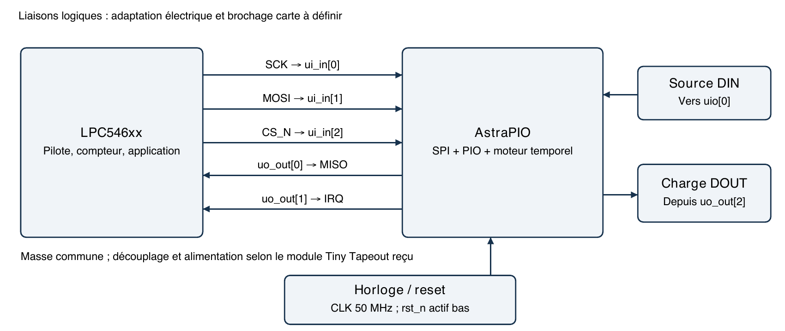
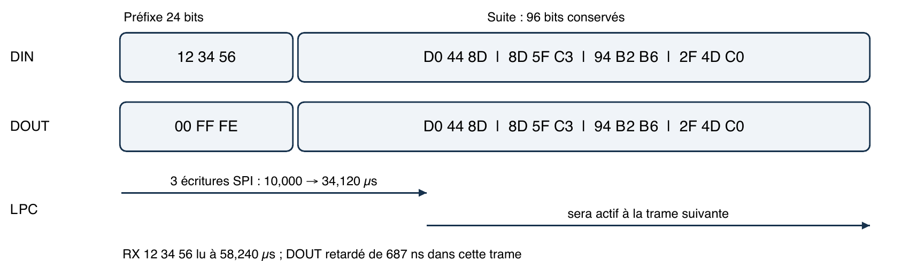

# Patching en direct d’un flux WS2812 avec AstraPIO

AN APIO 001 · Révision 1.0 · 23 septembre 2026 · AstraPIO ABI 5

Cette note explique comment insérer AstraPIO dans un flux WS2812 pour lire
le premier mot de 24 bits, le remplacer par une valeur préparée par un
microcontrôleur et transmettre les mots suivants sans modifier leurs données.
Le LPC546xx sert ici d’exemple d’hôte SPI ; le mécanisme ne dépend pas de ce CPU.

## 1 Fonction réalisée

Après une période basse qualifiée, le moteur temporel capture les 24 premiers
bits de DIN dans sa banque RX. Pendant cette réception, DOUT émet le mot de
remplacement actif. Les bits suivants sont décodés puis régénérés avec leur
valeur d’origine. L’hôte lit la capture par SPI et prépare, si nécessaire,
le mot d’une prochaine trame.

```text
DIN      [ mot A de 24 bits ][ mot B ][ mot C ][ ... ]
DOUT     [ remplacement R  ][ mot B ][ mot C ][ ... ]
SPI RX   A disponible après la capture des 24 bits
```

La longueur de la trame est conservée. AstraPIO ne consomme pas un mot comme
une LED physique le ferait dans une chaîne : la première LED située après
AstraPIO reçoit R, la suivante B, puis C. Le remplacement porte sur le
préfixe, pas sur un pixel arbitraire au milieu de la trame.

Le moteur temporel assure tout le traitement des fronts. **Aucun programme
PIO n’est nécessaire pour ce chemin** : les 16 instructions restent disponibles
pour une autre fonction utilisant des sorties distinctes. L’hôte calcule les
valeurs, traite les captures et gère les erreurs ; il ne pilote pas chaque bit.

Le relais nécessite les fronts DIN. Charger un mot TX ne génère pas une trame
en l’absence d’entrée. Une valeur de remplacement préparée à l’avance ne peut
pas être calculée à partir du mot entrant complet pour cette même trame,
puisque sa transmission commence avant la fin de la capture.

<!-- page -->

## 2 Raccordement logique



Ce schéma décrit les signaux, pas un circuit électrique prêt à fabriquer.
La source DIN peut être un générateur WS2812 ou la sortie d’une LED en amont.
L’entrée de la première LED à modifier se raccorde à DOUT via l’adaptation
électrique appropriée.

| Signal | Port AstraPIO | Règle |
|---|---|---|
| DIN applicatif | `uio[0]`, index I0 | Garder son driver désactivé |
| DOUT applicatif | `uo_out[2]`, index O8 | Exclure O8 du masque PIO |
| SCK / MOSI / CS | `ui_in[0:2]` | SPI mode 0, MSB en premier |
| MISO / IRQ | `uo_out[0:1]` | MISO dédié ; IRQ active à 1 |
| CLK | Horloge du module | 50 MHz pour le profil de cette note |

Vérifier le brochage de la carte IHP, les rails, les masses communes et les
seuils logiques. AstraPIO n’a pas de tolérance 5 V spécifiée. Les adaptations
de niveau doivent préserver les largeurs d’impulsion dans les deux directions.
Les LED nécessitent leur propre alimentation dimensionnée pour leur charge.

MISO reste piloté avec CS haut. Si le bus SPI est partagé, prévoir un isolement
adapté au lieu de raccorder directement plusieurs MISO push-pull. La sortie
applicative DOUT et le SPI hôte sont deux interfaces distinctes.

<!-- page -->

## 3 Profil temporel à 50 MHz

Le profil ci-dessous a été exercé en simulation. Il vise les temporisations
WS2812B V5 ; il ne constitue pas une compatibilité universelle avec toutes
les références commercialisées sous le nom WS2812.

| Registre | Valeur | Effet avec CLK à 50 MHz |
|---|---|---|
| `0x62 TIMED_PINS` | `0x0080` | Entrée I0, sortie O8 |
| `0x63 IDLE_CYCLES` | `0x3A98` | 15 000 cycles bas, soit 300 µs |
| `0x64 SAMPLE_LAUNCH` | `0x2019` | Échantillonnage à 25 cycles ; lancement à 32 cycles |
| `0x65 HIGH_WIDTHS` | `0x2010` | Sortie haute pendant 16 cycles pour 0, 32 pour 1 |
| `0x66 PREFIX_BITS` | `0x0018` | Préfixe de 24 bits |

Les impulsions DOUT durent 320 ns pour 0 et 640 ns pour 1. La période des bits
provient des fronts DIN, pas d’un oscillateur de protocole interne. Le délai
LAUNCH de 640 ns est interne ; la synchronisation d’entrée ajoute une latence.
Les essais fonctionnels observent 680 à 699 ns de front DIN à front DOUT.

La fiche Worldsemi WS2812B V5 [1] spécifie T0H de 220 à 380 ns, T1H de
580 à 1 000 ns, les durées basses T0L/T1L de 580 à 1 000 ns et un reset bas
supérieur à 280 µs. Les mots sont transmis en ordre GRB, bit fort en premier.
Vérifier la fiche exacte des LED installées avant d’adopter ce profil.

La qualification AstraPIO exige ici 300 µs de bas : une source dont le reset
est seulement supérieur à 280 µs peut ne pas armer le moteur. Pour les essais,
imposer au moins 310 µs de bas avant la première trame et entre les trames.
Le temps commence après activation du moteur pour le premier armement.

Pour une période DIN de 1 250 ns, les valeurs nominales basses DOUT sont
930 ns après un bit 0 et 610 ns après un bit 1. Tenir compte de la quantification
de CLK, de sa précision, des pads et de l’adaptation de niveau. Changer CLK
impose de recalculer tous les paramètres et de revalider le profil.

<!-- page -->

## 4 Initialisation et premier mot

Démarrer après un reset global connu, avec DIN maintenu bas, CS haut et SCK bas.
Les seuls appels de désactivation ne purgent pas un COMMIT en attente ni une
capture valide. Le [démarrage rapide](../getting-started.md) décrit le reset
et le contrat de transport SPI.

1. Vérifier ID `0x5049`, ABI `0x0500`, contextes `1`, capacité `0x1002`, puis TIMED_ID `0x5449` et TIMED_VERSION `0x0118`.
2. Garder le moteur désactivé. Vérifier que le PIO ne pilote pas I0 et ne revendique pas O8. Après reset, masque et directions sont nuls.
3. Écrire et relire les cinq paramètres du tableau précédent ; vérifier les états d’erreur.
4. Écrire les deux moitiés du mot TX, les relire, puis effectuer COMMIT moteur désactivé.
5. Activer capture, sortie et remplacement ; laisser DIN bas pendant au moins 310 µs, puis envoyer une trame.

Exemple de séquence brute pour une première valeur `0x00FFFE` :

```text
W(61, 0000)     moteur désactivé
W(62, 0080)     routage I0 vers O8
W(63, 3A98)     intervalle bas
W(64, 2019)     sample et launch
W(65, 2010)     H0 et H1
W(66, 0018)     24 bits
W(67, FFFE)     TX bits 15 à 0
W(68, 0000)     TX bits 23 à 16
relire paramètres et TX ; vérifier les erreurs
W(61, 0200)     COMMIT, moteur encore désactivé
W(61, 0007)     ENABLE + OUTPUT + REPLACE
```

W représente une transaction SPI complète, dont le résultat doit être contrôlé.
Un octet de commande 02, un octet d’adresse et deux octets de données sont
envoyés pour chaque ligne. Une première trame fait passer le mot préparé vers
la banque active ; il n’est pas nécessaire de fournir 24 octets ni de charger
la mémoire programme PIO.

La fonction C `pio_timed_configure()` programme et relit les paramètres.
`pio_timed_stage()` écrit et vérifie les deux moitiés TX puis effectue COMMIT.
`pio_timed_control()` active le mode choisi. L’exemple portable complet est
[ws2812_patch.c](examples/ws2812_patch.c) ; il nécessite un transport de carte
implémentant le contrat de `pio_device`.

<!-- page -->

## 5 Mise à jour sans déchirer la trame



Illustration issue du scénario fonctionnel : le mot sortant courant reste
`0x00FFFE` alors que l’hôte prépare `0x00FFFF`. Le chronogramme représente
trois écritures SPI brutes, pas la durée du pilote C complet.

Le moteur dispose d’une banque TX de préparation et d’une banque active.
COMMIT verrouille la première. Au premier front d’une nouvelle trame après
qualification du bas, son contenu est transféré vers la banque active.
Le mot actif ne change pas pendant la trame.

| Moment de la demande | Effet |
|---|---|
| Pendant une trame | Le COMMIT accepté s’applique à une trame qualifiée suivante |
| Suffisamment avant son premier front | La nouvelle valeur peut servir à cette trame |
| Au voisinage exact de la frontière | L’hôte ne peut pas garantir laquelle des deux trames l’utilisera |
| `COMMIT_PENDING=1` | Pas de seconde place disponible ; différer la demande |
| Aucune demande | La valeur active est réutilisée |

Pour un compteur, calculer `(derniere_valeur_preparee + 1) & 0xFFFFFF` côté
hôte. Mettre à jour cette variable seulement après le succès de `stage()`.
Cette variable désigne la valeur préparée, pas une preuve que les LED l’ont
déjà reçue. Une valeur peut être en attente jusqu’à l’arrivée de DIN.

Si `stage()` renvoie `PIO_EFULL`, conserver la demande dans une file logicielle
et attendre. Après une erreur de transport, ne pas réémettre aveuglément le
COMMIT : son effet peut être incertain. Il faut rétablir un état connu avant
de poursuivre le comptage. La désactivation seule n’annule pas un COMMIT.

<!-- page -->

## 6 Réception et service de l’hôte

Quand les 24 bits sont capturés, `RX_VALID` passe à 1 et IRQ est activée.
Le mot RX reste stable jusqu’à ACK. Le reste de la trame continue d’être
relayé pendant les transactions SPI. Une seule capture est disponible,
indépendamment de la FIFO RX du PIO.

```text
tâche propriétaire du périphérique
    lire TIMED_STATUS et PIO_ERROR
    si erreur présente : diagnostiquer avant de l’acquitter
    si RX_VALID
        lire RX_PREFIX_LO et RX_PREFIX_HI
        accepter/copier le mot dans l’application
        écrire 0x0107 dans TIMED_CTRL
    traiter une demande de nouvelle valeur si la banque TX est libre
    vérifier les sources si IRQ reste active
```

`0x0107` conserve les trois bits de mode tout en acquittant RX. Écrire
seulement `0x0100` désactiverait le moteur. De même, `0x0407` efface les
erreurs tout en conservant le mode, après traitement de leur cause.

Tous les accès au même `pio_device` doivent être sérialisés, y compris
ceux initiés par interruption ou DMA. Une ISR peut réveiller une tâche de
service ; elle ne doit pas couper une transaction SPI déjà en cours.
Un ACK doit suivre l’acceptation des deux moitiés du mot, jamais la précéder.

Si une nouvelle trame débute avant ACK, le circuit garde l’ancienne capture,
signale RX_OVERRUN et ignore la nouvelle capture. Le relais peut continuer.
Un ACK au milieu de cette nouvelle trame ne récupère pas son préfixe.
Dimensionner le service hôte pour acquitter chaque capture avant le prochain
début de trame lorsque toutes les acquisitions sont requises.

La durée nominale d’un mot à 800 kbit/s est 30 µs. Le budget de service RX
s’étend ensuite jusqu’au début de la trame suivante, en incluant la suite de
la trame et son intervalle bas. Il dépend donc du nombre de LED et de la
cadence réelle des trames, pas seulement du débit des bits.

L’autonomie du relais ne signifie pas absence de supervision : l’application
doit gérer les erreurs, les demandes de valeur et les limites de latence.

<!-- page -->

## 7 Vérification de l’application

Le banc de test envoie 12 trames de 120 bits : un mot remplacé et quatre mots
relayés. Il vérifie les captures SPI, le nombre et la valeur des bits DOUT,
leurs largeurs, les mises à jour atomiques, IRQ/ACK et l’exécution simultanée
d’un programme PIO sur une autre broche. Il exerce les retenues et le
rebouclage du compteur 24 bits, ainsi que les trames sans demande d’incrément.

Le rejeu de référence passe 12 scénarios en RTL et 12 sur la netlist routée,
avec 1 440 bits de sortie vérifiés par mode dans le scénario compteur.
Les deux modèles donnent les mêmes observations. Ce sont des simulations
fonctionnelles sans SDF, avec un modèle SPI de l’hôte, pas un LPC réel.

```sh
python3 tools/check_final_release.py
make -C test/ws2812 MODE=rtl
python3 tools/check_results.py work/ws2812-counter-replay/rtl/results.xml
make -C test/ws2812 MODE=gl
python3 tools/check_results.py work/ws2812-counter-replay/gl/results.xml
```

Installer d’abord Icarus Verilog 13 et les dépendances de `test/requirements.txt`
dans un environnement Python. Les commandes sont détaillées dans le
[guide du banc de test](../../test/ws2812/README.md).

Sur carte, contrôler à l’oscilloscope CLK, DIN et DOUT, les durées hautes et
basses, le reset de trame et les niveaux électriques. Essayer des préfixes
`000000`, `FFFFFF`, `AAAAAA`, `555555`, une longue suite inchangée, des mises
à jour pendant la trame et un hôte volontairement retardé. Vérifier les
compteurs d’erreurs logiciels et le comportement de récupération avant
d’utiliser le montage dans l’application.

## Références

[1] [Worldsemi WS2812B V5, pages 3 et 4](https://www.world-semi.co.kr/_files/ugd/89cd03_1023b0e9d135431aa1e6491bfc318112.pdf) : temporisations et ordre des bits, consulté le 23 septembre 2026.

[2] [Manuel de référence AstraPIO ABI 5](../reference.md), moteur temporel et interface SPI.

[3] [Scénario de simulation](../../test/test_ws2812_counter.py) et [pilote C](../../firmware/pio_timed.c).

[PDF](AN_APIO_001_WS2812_Rev1.0_FR.pdf) · [Word modifiable](AN_APIO_001_WS2812_Rev1.0_FR.docx)
