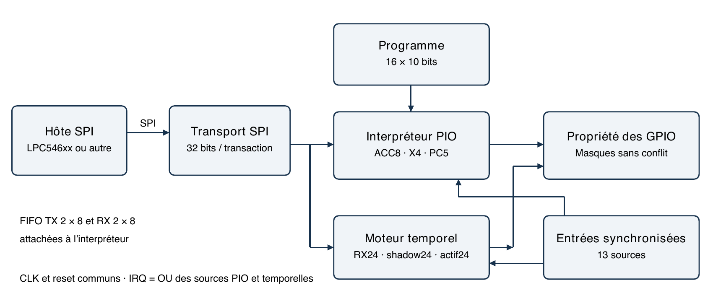
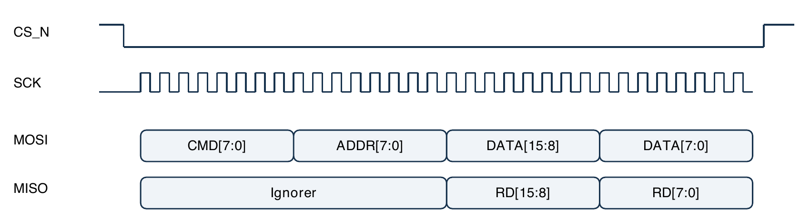
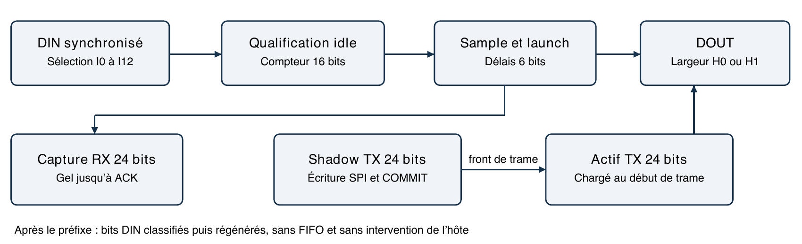
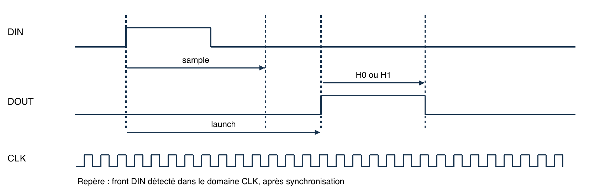

# AstraPIO

Coprocesseur programmable pour entrées sorties numériques

Datasheet et manuel de référence logiciel

ABI 5 • Moteur temporel 0x0118 • Révision documentaire 1.1 • 23 septembre 2026

AstraPIO décharge un microcontrôleur hôte des séquences numériques déterministes. Un interpréteur PIO exécute un programme court, tandis qu’un moteur temporel indépendant capture, remplace et régénère des impulsions. L’hôte charge les paramètres et échange des données par SPI ; il ne cadence pas les bits du flux temporel.

### Caractéristiques principales

| Fonction | Caractéristique |
| --- | --- |
| PIO | Un contexte ; accumulateur 8 bits ; compteur de boucle 4 bits |
| Programme | 16 instructions de 10 bits ; 160 bits utiles en latches |
| Exécution | Un créneau toutes les 4 périodes CLK ; 80 ns à 50 MHz |
| Données | FIFO TX de 2 octets et FIFO RX de 2 octets |
| Moteur temporel | Préfixe de 1 à 24 bits ; relais et remplacement atomique |
| Interface hôte | SPI esclave mode 0 ; commande 8 + adresse 8 + donnée 16 bits |
| Broches applicatives | 13 sources d’entrée et 14 destinations de sortie logiques ; 8 partagées |
| Intégration | Tiny Tapeout IHP SG13G2 ; allocation 1 × 2 tiles |
| Identités | PIO_ID = 0x5049 ; ABI = 0x0500 ; TIMED_ID = 0x5449 |

### Applications

Séquences de contrôle GPIO, émission UART ou série par programme, capture et régénération de signaux à largeur d’impulsion. Les exemples de la section 20 illustrent ces usages ; la note d’application AN APIO 001 détaille le patching WS2812.

### Statut des caractéristiques

Données préliminaires avant caractérisation sur silicium. Ce document spécifie le comportement logique de l’interface ABI 5. Les caractéristiques électriques, les limites absolues et les performances réelles sur carte ne sont pas encore des valeurs garanties.

DS APIO 001 • Interface logicielle 0x0500 • Bloc Tiny Tapeout IHP 1 × 2 tiles

## 2 Guide de lecture

Ce document s’adresse aux concepteurs de cartes, développeurs de pilotes et auteurs de programmes PIO. Il réunit la description fonctionnelle du bloc et son interface de programmation. Les noms de registres utilisés ici sont des noms documentaires ; les adresses et champs proviennent du RTL ABI 5.

| Section | Contenu |
| --- | --- |
| 3 à 7 | Architecture, brochage, GPIO, reset et caractéristiques électriques |
| 8 et 9 | Format SPI et contraintes temporelles du transport |
| 10 à 12 | Registres PIO, FIFO et mémoire programme |
| 13 et 14 | Jeu d’instructions ABI 5 et règles d’exécution |
| 15 à 18 | Moteur temporel, registres et chronogrammes |
| 19 | Connexion à un microcontrôleur et mise à jour atomique |
| 20 et 21 | Exemples courts et pilote portable C |
| 22 | Erreurs, récupération et limites d’intégration |

### Conventions

| Notation | Signification |
| --- | --- |
| 0x / [m:n] | Valeur hexadécimale / champ allant du bit m au bit n, inclus |
| R / W / R/W | Lecture / écriture / lecture et écriture |
| W1C / strobe | Écrire 1 pour acquitter / commande ponctuelle non mémorisée |
| Reset | Valeur observable après reset global effectif, sauf mention contraire |
| TCLK | Période du CLK du bloc ; 20 ns dans la configuration à 50 MHz |
| TX / RX | Point de vue du PIO : TX hôte → PIO ; RX PIO → hôte |
| Donnée non valide | Le registre retourne zéro lorsque cette règle est explicitement indiquée |

### Portée des valeurs

« Fonctionnel » décrit les règles implémentées. « Calculé » désigne une conséquence arithmétique du RTL. « Simulé » concerne les bancs de test ; « STA » l’analyse temporelle statique. Aucun de ces termes ne signifie caractérisation électrique sur des puces fabriquées.

Les bits réservés se lisent à zéro dans les registres implémentés ; écrire zéro aux bits réservés, sauf champ explicitement décrit comme tronqué. Les adresses non implémentées se lisent à zéro ; leurs écritures provoquent HOST_ERROR sur la page correspondante. Assembler les programmes explicitement pour ABI 5.

## 3 Architecture fonctionnelle



Figure 1  Organisation logique du bloc AstraPIO

Le PIO et le moteur temporel fonctionnent simultanément sur des sorties distinctes. Le PIO exécute une instruction par créneau de quatre cycles ; le moteur temporel travaille à chaque cycle CLK. Les transactions SPI de l’hôte ne cadencent pas les transitions applicatives.

| Ressource | Capacité | Usage |
| --- | --- | --- |
| Mémoire programme | 16 × 10 bits | Instructions uniquement ; pas une RAM de données générale |
| FIFO PIO | TX 2 × 8 ; RX 2 × 8 | Flux d’octets avec blocage de PULL/PUSH |
| État PIO | ACC 8 ; X 4 ; PC 5 bits | Calcul, boucle et position dans le programme |
| Banques temporelles | 3 × 24 bits | Capture RX, staging TX et mot actif TX |
| Broches temporelles | 1 entrée ; 0 ou 1 sortie | Sélection parmi les broches logiques disponibles |

La mémoire programme contient uniquement des instructions. Les données transitent par les FIFO ou les banques du moteur temporel ; ce dernier ne traverse pas les FIFO PIO. Le programme et la configuration sont volatiles et doivent être rechargés après un reset global.

## 4 Brochage logique

Les noms ci-dessous désignent les ports du projet Tiny Tapeout. Ils ne sont pas des numéros de boîtier ni de connecteur. Le brochage physique dépend du shuttle et de la carte porteuse. Les alimentations et la sélection de projet relèvent de cette infrastructure.

| Port | Sens | Fonction AstraPIO | Reset du bloc |
| --- | --- | --- | --- |
| clk | Entrée | Horloge principale externe | Sans objet |
| rst_n | Entrée | Reset global actif à zéro | Actif à 0 |
| ena | Interne TT | Sélection / activation du bloc | 0 force le reset interne |
| ui_in[0] | Entrée | HOST_SCK ; horloge SPI hôte | SCK attendu à 0 |
| ui_in[1] | Entrée | HOST_MOSI ; données SPI hôte | Indifférent hors transfert |
| ui_in[2] | Entrée | HOST_CS_N ; sélection SPI | CS_N attendu à 1 |
| ui_in[3] | Entrée | Source PIO I8 | Échantillonnée après reset |
| ui_in[4] | Entrée | Source PIO I9 | Idem |
| ui_in[5] | Entrée | Source PIO I10 | Idem |
| ui_in[6] | Entrée | Source PIO I11 | Idem |
| ui_in[7] | Entrée | Source PIO I12 | Idem |
| uo_out[0] | Sortie | HOST_MISO ; sortie SPI push-pull | 0 |
| uo_out[1] | Sortie | HOST_IRQ ; interruption active à 1 | 0 |
| uo_out[2] | Sortie | Destination PIO O8 | 0 |
| uo_out[3] | Sortie | Destination PIO O9 | 0 |
| uo_out[4] | Sortie | Destination PIO O10 | 0 |
| uo_out[5] | Sortie | Destination PIO O11 | 0 |
| uo_out[6] | Sortie | Destination PIO O12 | 0 |
| uo_out[7] | Sortie | Destination PIO O13 | 0 |
| uio[7:0] | Bidir. | Sources I7:I0 et destinations O7:O0 | Sorties désactivées |

### Règles de câblage

Les six sorties uo_out[7:2] ne deviennent pas haute impédance quand le programme s’arrête. MISO ne devient pas haute impédance quand CS_N est inactif. Prévoir un bus hôte dédié ou un isolement externe de MISO ; ne pas relier plusieurs sorties push-pull directement.

Pour sélectionner le bloc, utiliser la correspondance des projets fournie avec le shuttle et la carte effectivement livrés. Les identifiants de plateforme ne sont pas des numéros de broche.

## 5 GPIO et propriété des broches

| Broche | Index entrée | Index sortie | Commande de direction |
| --- | --- | --- | --- |
| uio0 | 0 | 0 | DIR, bit ACC0 ; ou moteur temporel |
| uio1 | 1 | 1 | DIR, bit ACC1 ; ou moteur temporel |
| uio2 | 2 | 2 | DIR, bit ACC2 ; ou moteur temporel |
| uio3 | 3 | 3 | DIR, bit ACC3 ; ou moteur temporel |
| uio4 | 4 | 4 | DIR, bit ACC4 ; ou moteur temporel |
| uio5 | 5 | 5 | DIR, bit ACC5 ; ou moteur temporel |
| uio6 | 6 | 6 | DIR, bit ACC6 ; ou moteur temporel |
| uio7 | 7 | 7 | DIR, bit ACC7 ; ou moteur temporel |
| ui_in[3:7] | 8 à 12 | Aucun | Entrées dédiées |
| uo_out[2:7] | Aucun | 8 à 13 | Sorties dédiées, toujours pilotées |

Les 13 entrées et 14 sorties logiques ne représentent pas 27 broches distinctes : huit sont bidirectionnelles. L’interface hôte utilise trois entrées, deux sorties et les ports communs de contrôle.

### Masque du PIO

Le registre OUTPUT_MASK à 0x10 réserve un ensemble de sorties O0 à O13, même lorsque RUN vaut zéro. Il se modifie uniquement PIO arrêté. Aucun bit réservé au moteur temporel ne peut être revendiqué. Une écriture acceptée met à zéro les anciens niveaux et directions possédés par le PIO avant d’installer le nouveau masque.

SET, OUT et OUTBIT ne modifient que les sorties possédées. Une destination valide mais non possédée n’est pas une erreur. OUTBIT décale néanmoins l’accumulateur. DIR agit seulement sur les huit sorties uio possédées ; un bit à 1 active leur driver, un bit à 0 le désactive.

### Moteur temporel

Lorsque ENABLE et OUTPUT_ENABLE valent 1, le moteur réserve sa destination DOUT et force son output-enable si elle appartient à uio. Le multiplexeur sélectionne alors sa valeur. Les conflits de propriété sont rejetés par HOST_ERROR ; ils ne sont pas arbitrés dynamiquement.

### Échantillonnage et lecture

Les entrées traversent deux registres de synchronisation. INPUT_SAMPLE (0x09) donne ces valeurs synchronisées. Ce chemin ne remplace pas une garantie de largeur minimale d’impulsion ni un filtre anti-rebond. Les registres 0x07 et 0x08 lisent les états du PIO, pas la sortie finale ni la direction imposée par le moteur temporel.

## 6 Horloge reset et démarrage

### Horloge

Le domaine logique unique est CLK. SCK est échantillonné par ce domaine ; ce n’est pas une seconde horloge interne. La fréquence de référence est 50 MHz, soit TCLK = 20 ns. Les délais PIO et temporels sont des nombres de cycles ; changer CLK modifie toutes leurs durées.

| Événement | Effet |
| --- | --- |
| rst_n = 0 ou ena = 0 | Assertion asynchrone du reset interne et masquage des sorties ; uio_oe = 0 |
| rst_n = 1 et ena = 1 | Libération interne synchronisée par deux bascules ; horloge nécessaire |
| Reset global | Programme invalidé, RUN = 0, FIFO vides, masques et erreurs effacés ; moteur temporel désactivé |
| RUN = 0 | Interpréteur arrêté ; état, données et niveaux GPIO conservés |
| RESTART = 1 | Interpréteur arrêté, PC/ACC/X/délai/IRQ/événement remis à zéro ; FIFO vidées ; défaut PIO effacé |
| Arrêt temporel | Trame abandonnée et réservation DOUT relâchée ; ne remet pas toutes les banques et erreurs à zéro |

RESTART ne supprime ni le programme ni OUTPUT_MASK ni les niveaux/directions GPIO. Il n’efface pas le HOST_ERROR du PIO et ne réinitialise pas le moteur temporel. Les données physiques non resetées des latches sont masquées par les longueurs et indicateurs de validité.

### Séquence conseillée de mise en service

- Sélectionner AstraPIO sur la carte ; empêcher les autres circuits de piloter ses entrées hôte et ses sorties uio.

- Fournir une horloge stable. Maintenir CS_N = 1 et SCK = 0 pendant le reset.

- Maintenir le reset au moins cinq cycles CLK, puis attendre au moins cinq cycles après sa libération avant la première transaction. Cette séquence reproduit les tests, sans constituer une limite électrique mesurée.

- Lire PIO_ID, ABI, CONTEXTS et CAPACITY ; attendre respectivement 0x5049, 0x0500, 0x0001 et 0x1002.

- Configurer et charger les ressources arrêtées, relire la configuration, vérifier les erreurs, puis démarrer.

AstraPIO ne possède pas de démarrage autonome en ROM : le programme et les paramètres applicatifs doivent être rechargés après un reset global. Arrêter CLK pendant une activité fige l’état et peut maintenir une sortie haute ; aucune mise en sécurité automatique par watchdog n’est intégrée.

## 7 Caractéristiques électriques et temporelles

Le contrat logique du bloc est distinct des paramètres électriques de la puce complète et de sa carte porteuse. Les durées calculées à 50 MHz ne sont pas des mesures sur silicium.

| Paramètre | Valeur ou statut | Qualification |
| --- | --- | --- |
| Technologie | IHP SG13G2 | Intégration Tiny Tapeout IHP |
| Horloge de référence | 50 MHz / 20 ns | Référence fonctionnelle du bloc |
| Alimentation IO de la carte | À confirmer sur la carte TTIHP26b livrée | Ne pas déduire VDDIO de la tension cœur |
| VIH, VIL, VOH, VOL, IOH, IOL | Non spécifiés pour AstraPIO | Caractérisation de l’infrastructure / carte requise |
| Courant actif et repos | Non caractérisés | Pas de budget de puissance garanti |
| Capacité et temps de montée des IO | Non caractérisés sur carte | Dépendent des pads, multiplexeurs et charges |
| Limites absolues et ESD | Non spécifiées | Aucune tolérance 5 V ou protection garantie |
| Température de fonctionnement | Non qualifiée sur silicium | Ne pas convertir les coins STA en grade commercial |

### Dimensions du bloc

Le bloc utilisateur mesure 202,08 × 313,74 µm, soit 0,0634006 mm², pour une allocation 1 × 2 tiles. Ce sont les dimensions du bloc logique, pas celles de la puce complète ni du boîtier.

### Intégration électrique

Relier les masses, vérifier les rails de la carte, les seuils et la tolérance de chaque broche du microcontrôleur choisi. Ne pas appliquer directement un signal d’un autre domaine de tension sans vérifier sa compatibilité. Prévoir les adaptations de niveau et les protections nécessaires.

Le schéma de la carte Tiny Tapeout IHP utilisée est la référence pour le raccordement physique. Ne pas déduire la tension des connecteurs de celle du cœur logique, ni transposer les caractéristiques de pads d’une autre technologie. Documentation de raccordement : https://tinytapeout.com/specs/pinouts/

## 8 Protocole SPI hôte

AstraPIO est un esclave SPI en mode 0 (CPOL = 0, CPHA = 0), MSB en premier. Une assertion de CS_N transporte exactement quatre octets. L’adresse est celle d’un registre de 16 bits ; elle n’est pas incrémentée automatiquement.

| Octet | MOSI écriture | MOSI lecture | MISO lecture |
| --- | --- | --- | --- |
| 0 | 0x02 | 0x03 | Ignorer |
| 1 | Adresse | Adresse | Ignorer |
| 2 | DATA[15:8] | Dummy, généralement 0 | DATA[15:8] |
| 3 | DATA[7:0] | Dummy, généralement 0 | DATA[7:0] |



Figure 2  Découpage de la transaction SPI ; chronogramme logique non à l’échelle

### Exemples de trames

```text
Lecture ID       MOSI 03 00 00 00     MISO xx xx 50 49
Lecture ABI      MOSI 03 01 00 00     MISO xx xx 05 00
Arrêt PIO        MOSI 02 03 00 00
Chargement HALT  MOSI 02 40 03 06     mot ABI5 = 0x306
```

Les écritures prennent effet lorsque le dernier bit a été reçu et transféré dans le domaine CLK, sans attendre une nouvelle transaction. Une écriture interrompue avant 32 bits n’est pas appliquée. Les bits supplémentaires sous la même assertion de CS_N sont ignorés : ce n’est pas un mode burst.

Une commande différente de 0x02/0x03 est ignorée et n’émet pas d’acquittement. Il n’y a ni CRC, ni bit ACK sur le fil, ni notification fiable de violation des timings SPI. PIO_OK dans le pilote signifie d’abord succès du transport ; relire l’état ou la valeur pour vérifier l’acceptation matérielle.

## 9 Contraintes SPI et atomicité

| Symbole | Contrainte logique | À 50 MHz |
| --- | --- | --- |
| tSCKH | SCK haut ≥ 6 TCLK | ≥ 120 ns |
| tSCKL | SCK bas ≥ 6 TCLK | ≥ 120 ns |
| tCSS | CS_N bas avant le premier front actif ≥ 6 TCLK | ≥ 120 ns |
| tCSH | CS_N maintenu bas après la fin de l’horloge ≥ 6 TCLK | ≥ 120 ns |
| tCSG | CS_N haut entre deux transactions ≥ 6 TCLK | ≥ 120 ns |
| fSCK | ≤ fCLK / 12, sous réserve de toutes les autres contraintes | ≤ 4,1667 MHz calculés |
| MOSI | Changer au front descendant et conserver jusqu’au front montant suivant | Mode 0 ; pas de valeur pad setup/hold garantie |

La règle de six cycles provient du contrat RTL/driver et des simulations avec phases d’horloge balayées. Elle ne remplace pas une caractérisation des délais des pads de la puce complète. Pour le premier essai matériel, choisir une cadence plus lente, puis mesurer les marges.

### Instantané de lecture

Le registre est échantillonné au front SCK descendant synchronisé qui suit la réception du seizième bit (fin d’adresse). Les seize bits suivants sortent de cet instantané, même si le registre interne change ensuite. Les bits MOSI de cette phase de lecture sont ignorés.

### Lecture destructive de la FIFO RX

À 0x15, le bit 15 de l’instantané indique si un octet était présent. Un retrait FIFO n’a lieu qu’à la réception complète des 32 bits et seulement si cet instantané était valide. Une lecture abandonnée ne consomme rien. Une lecture initialement vide ne consomme pas un octet arrivé plus tard.

Après une erreur de transport dont l’instant exact est inconnu, ne pas relancer aveuglément une lecture RX : la première transaction peut déjà avoir consommé l’octet. La même incertitude existe pour une écriture ou un COMMIT dont le dernier bit a peut-être atteint le circuit.

### Débit et service hôte

Une transaction utilise 32 cycles SCK pour au plus 16 bits de registre, ou un octet de FIFO. À 4,1667 MHz, la limite brute est 130 208 transactions/s avant les gaps CS et les lectures de statut. Ce chiffre calculé n’est pas un débit applicatif garanti. Les deux octets de FIFO ne masquent pas une latence hôte arbitraire.

## 10 Registres globaux du PIO

Toutes les adresses sont hexadécimales. Les valeurs de reset sont observables après reset global. Les bits non nommés sont réservés. Le contexte unique utilise le bit 0 des masques de commande.

| Adr. | Nom | Accès | Reset | Champs et effet |
| --- | --- | --- | --- | --- |
| 00 | PIO_ID | R | 5049 | Identité du bloc |
| 01 | ABI | R | 0500 | Version de l’interface et de l’encodage |
| 02 | CONTEXTS | R | 0001 | Un interpréteur |
| 03 | RUN | R/W | 0000 | [0] exécution. W : 0 arrêt ; 1 marche si pas de défaut et mémoire libre ; autre valeur rejetée |
| 04 | RESTART | W | 0000 | W=1 : restart et vidage FIFO ; W=0 sans effet ; lecture 0 |
| 05 | PIO_IRQ | R/W1C | 0000 | [0] IRQ logicielle. W=1 efface cette seule source ; W=0 conserve |
| 06 | PIO_ERROR | R/W | 0000 | R : [8] FAULT, [0] HOST_ERROR. W=1 efface HOST_ERROR uniquement ; autre valeur invalide |
| 07 | PIO_OUT | R | 0000 | [13:0] niveaux mémorisés par le PIO, avant le multiplexeur temporel |
| 08 | PIO_OE | R | 0000 | [7:0] directions uio du PIO, avant réservation temporelle |
| 09 | INPUT_SAMPLE | R | 0000 | [12:0] entrées synchronisées ; évoluent après reset |
| 0A | PROGRAM_LENGTH | R/W | 0000 | R : [4:0] longueur 0..16. W=0 arrêté et non busy : invalide le programme et PC=0 |
| 0B | PROGRAM_BUSY | R | 0000 | [0] écriture mémoire interne en cours |
| 0C | RX_IRQ_MASK | R/W | 0000 | [0] active l’IRQ tant que la FIFO RX est non vide |
| 0D | EVENT_SET | R/W | 0000 | R : [0] événement. W=1 le pose ; W=0 sans effet |
| 0E | EVENT_CLEAR | R/W | 0000 | R : [0] événement. W=1 l’efface ; W=0 sans effet |
| 0F | CAPACITY | R | 1002 | [15:8]=16 mots ; [7:0]=2 octets par FIFO |

Aux adresses 0x05, 0x0C, 0x0D et 0x0E, seules les valeurs 0 et 1 sont acceptées. Les écritures sur les registres R sont rejetées par HOST_ERROR. RUN n’effectue pas de restart implicite ; HALT et STOP conservent les sorties.

### Interruption partagée

HOST_IRQ = PIO_IRQ OR FAULT OR HOST_ERROR OR (RX_IRQ_MASK AND RX non vide) OR IRQ temporelle. Il s’agit d’un niveau actif haut, pas d’une impulsion. Aucun masque global ne masque FAULT, HOST_ERROR ou les sources temporelles. Lire les deux pages d’état avant d’acquitter.

## 11 Registres de contexte et FIFO

| Adr. | Nom | Accès | Reset | Description |
| --- | --- | --- | --- | --- |
| 10 | OUTPUT_MASK | R/W | 0000 | [13:0] sorties possédées ; modification arrêté ; aucun conflit temporel |
| 11 | PC | R/W | 0000 | R : [4:0] PC courant. W : adresse 0..15, arrêté uniquement |
| 12 | ACC | R/W | 0000 | [7:0] accumulateur ; W arrêté ; bits hauts de W ignorés |
| 13 | DELAY_LEFT | R | 0000 | [7:0] créneaux de délai restants |
| 14 | TX_DATA | W | 0000 | W : ajoute les 8 bits bas à TX ; bits hauts ignorés. Lecture 0 |
| 15 | RX_DATA | R pop | 0000 | [15] VALID ; [7:0] octet. Lecture complète valide consomme un octet |
| 16 | FIFO_STATUS | R | 0005 | Niveaux et drapeaux ci-dessous |
| 17 | LOOP_COUNTER | R/W | 0000 | [3:0] compteur X ; W arrêté ; bits hauts ignorés |
| 1F | PROGRAM_LENGTH_ALIAS | R | 0000 | [4:0] longueur programme ; alias de lecture de 0x0A |

| Bits de 0x16 | Nom | Signification |
| --- | --- | --- |
| [15:14] | RX_LEVEL | Nombre d’octets RX, de 0 à 2 |
| [13:12] | TX_LEVEL | Nombre d’octets TX, de 0 à 2 |
| [11:4] | Réservés | Zéro |
| [3] / [2] | RX_FULL / RX_EMPTY | RX pleine / vide |
| [1] / [0] | TX_FULL / TX_EMPTY | TX pleine / vide |

### Règles de transfert

TX_DATA peut être écrit PIO arrêté ou actif. Une écriture alors que TX est pleine est rejetée avec HOST_ERROR, sauf si un PULL effectif libère simultanément une place. PULL bloque le programme quand TX est vide ; PUSH bloque quand RX est pleine, sans effacer de donnée.

Il n’existe pas de bypass combinatoire d’une FIFO vide. Une arrivée et un retrait simultanés conservent le niveau quand tous deux sont acceptés. RESTART et reset invalident les deux FIFO. Ni RUN=0 ni HALT ne les vident.

Lire 0x15 vide renvoie 0 et ne provoque pas d’erreur. Lire 0x16 n’est pas destructif. Les adresses 0x18..0x1E et 0x20..0x2F sont non implémentées : lecture 0, écriture invalide.

## 12 Mémoire programme et lancement

Les adresses 0x40..0x4F contiennent chacune une instruction ABI 5 dans les bits [9:0] d’une transaction de 16 bits. Les bits [15:10] doivent être nuls. Le stockage utile de 160 bits n’est pas une RAM de 20 octets adressable octet par octet.

| Opération | Condition et résultat |
| --- | --- |
| Écriture de programme | RUN=0, BUSY=0, mot ≤0x03FF et adresse locale ≤ longueur actuelle |
| Ajout d’une instruction | Adresse locale = longueur : la longueur est incrémentée |
| Remplacement d’une instruction | Adresse locale < longueur : la longueur est conservée |
| Trou dans le programme | Adresse locale > longueur : rejet, HOST_ERROR ; aucun allongement |
| Lecture | Donnée valide seulement si arrêté, non busy et index < longueur ; sinon zéro |
| Opcode réservé | Peut être stocké et relu ; déclenche FAULT s’il est exécuté |
| Fin du programme | PC ne reboucle pas de 15 vers 0 ; un accès PC ≥ longueur arrête avec FAULT |

### Séquence de chargement sûre

```text
W(0x03, 0x0000);       // arrêter le PIO
W(0x04, 0x0001);       // restart et purge des FIFO
W(0x06, 0x0001);       // effacer HOST_ERROR si nécessaire
attendre R(0x0B) == 0;
W(0x0A, 0x0000);       // invalider le programme
for (i = 0; i < N; ++i) {
    W(0x40 + i, code10[i]);
    attendre R(0x0B) == 0;
    vérifier R(0x40 + i) == code10[i];
}
W(0x10, masque);       // propriété des sorties
W(0x11, entree);       // 0 <= entree < N
vérifier R(0x0A) == N et R(0x06) == 0;
W(0x03, 0x0001);
```

W/R représentent ici une transaction SPI complète, avec les timings requis et contrôle de l’erreur de transport. Le polling doit avoir un timeout logiciel. N doit être entre 1 et 16. Relire OUTPUT_MASK et RUN permet de vérifier leur acceptation.

L’écriture interne des latches occupe deux cycles après la prise de requête. Le rythme SPI conforme est nettement plus lent, mais BUSY reste l’indication de référence. Les mots ne sont pas physiquement effacés au reset : PROGRAM_LENGTH=0 les rend inaccessibles.

### Assemblage

```text
python3 tools/pioasm.py --abi 5 examples/compact/uart_tx.pio
```

Toujours préciser --abi 5 pour produire le format du circuit. Une ligne d’instruction occupe un mot ; les labels et commentaires ne consomment pas de mémoire.

## 13 Instructions et calcul

ACC est l’accumulateur de 8 bits, X le compteur de 4 bits et PC le pointeur d’instruction. Une instruction s’exécute dans un créneau de quatre cycles CLK. Hors branchement/blocage, PC est incrémenté. Les opérations arithmétiques bouclent à leur largeur, sans registre de drapeaux général.

| Instruction | Code 10 bits | Effet |
| --- | --- | --- |
| LDI k | 0x000 + k | ACC ← k, k de 0 à 255 |
| DELAY k | 0x100 + k | Charge k créneaux d’attente après cette instruction |
| XOR k | 0x200 + k | ACC ← ACC XOR k |
| NOP | 0x300 | Aucun effet autre que PC |
| DIR | 0x301 | Directions uio possédées ← ACC[7:0] |
| DEC | 0x302 | ACC ← ACC − 1 modulo 256 |
| SHL | 0x303 | ACC ← {ACC[6:0],0} |
| SHR | 0x304 | ACC ← {0,ACC[7:1]} |
| IRQ | 0x305 | Pose PIO_IRQ ; ne bloque pas le programme |
| HALT | 0x306 | RUN ← 0 ; PC avance ; sorties conservées |
| PULL | 0x307 | ACC ← prochain octet TX ; bloque si vide |
| PUSH | 0x308 | Ajoute ACC à RX ; bloque si pleine |
| AWAIT | 0x309 | Attend EVENT puis le consomme |
| CLR_EVENT | 0x30A | Efface EVENT |
| IN | 0x30B | ACC ← entrées synchronisées I7:I0 |
| IN 1 | 0x30C | ACC[4:0] ← I12:I8 ; ACC[7:5] ← 0 |
| OUT | 0x30D | Sorties possédées O6:O0 ← ACC[6:0] |
| OUT 1 | 0x30E | Sorties possédées O13:O7 ← ACC[6:0] |

### Durée et blocage

À 50 MHz, les créneaux valent 80 ns, soit au plus 12,5 millions d’instructions/s calculés. DELAY k ajoute k créneaux vides : l’instruction suivante est exécutée (k+1) × 4 TCLK après DELAY. WAIT, PULL, PUSH et AWAIT retentent à chaque créneau, pas à chaque cycle CLK.

Une instruction HALT n’est pas un reset. Relancer RUN reprend au PC suivant ; si ce PC dépasse la longueur, FAULT est levé. Il n’existe pas d’instruction ADD, de pile, d’appel de sous-programme ou de multiplication.

## 14 Branchements et instructions de broche

| Instruction | Code | Effet et bornes |
| --- | --- | --- |
| JMP a | 0x310 \| a | PC ← a ; a de 0 à 15 |
| JNZ a | 0x320 \| a | PC ← a si ACC ≠ 0 |
| JBIT a | 0x330 \| a | PC ← a si ACC[7] = 1 |
| WAIT p,0 | 0x340 \| p | Attend que l’entrée Ip synchronisée vaille 0 ; p de 0 à 12 |
| WAIT p,1 | 0x350 \| p | Attend que l’entrée Ip synchronisée vaille 1 ; p de 0 à 12 |
| SET p,0 | 0x360 \| p | Met Op à 0 si possédée ; p de 0 à 13 |
| SET p,1 | 0x370 \| p | Met Op à 1 si possédée ; p de 0 à 13 |
| OUTBIT p | 0x380 \| p | Op ← ACC[7] si possédée, puis ACC ← ACC << 1 ; p de 0 à 13 |
| INBIT p | 0x390 \| p | ACC ← {ACC[6:0],Ip} ; p de 0 à 12 |
| LDX n | 0x3A0 \| n | X ← n ; n de 0 à 15 |
| DJNZ a | 0x3B0 \| a | X ← X − 1 modulo 16 ; branche si ancien X ≠ 1 |

### Cas particuliers

LDX 0 suivi d’une boucle DJNZ réalise seize passages avant sortie, par bouclage modulo 16. Les instructions de branchement acceptent une adresse encodée 0..15, mais le programme doit effectivement contenir la destination. Un PC hors de la longueur chargée déclenche FAULT au prochain créneau valide.

OUT et OUT 1 adressent deux groupes de sept sorties ; ce ne sont pas deux banques de huit. O7 est dans OUT 1, alors qu’I7 est lu par IN. Pour une broche isolée, SET/OUTBIT/INBIT utilisent les indices absolus de la section 5.

### Encodages invalides

0x30F, 0x3C0..0x3FF, les indices entrée 13..15 et sortie 14..15 sont réservés. Leur exécution lève FAULT et arrête RUN. Les instructions et opérandes définis ici correspondent à 944 mots ; les 80 autres encodages de 10 bits sont invalides.

### Synchronisation logicielle

EVENT est un drapeau d’un bit, pas un compteur ni une file. Des événements répétés avant consommation se confondent. Les affectations dues à une instruction interviennent après celles de l’accès hôte au même cycle ; ne pas utiliser des écritures concurrentes SET/CLEAR/AWAIT comme protocole de comptage sans acquittement logiciel.

Le PIO n’a pas d’interruption entrante qui préempte son programme. AWAIT/WAIT constituent des attentes coopératives. L’IRQ émise avertit l’hôte ; elle ne change pas le flot d’exécution du PIO.

## 15 Moteur temporel autonome

Le moteur reconnaît une nouvelle trame après une durée configurable de niveau bas sur DIN. Chaque front montant déclenche un échantillonnage retardé de DIN : sa valeur à cet instant détermine le bit. La sortie est lancée après un autre délai, avec une largeur haute choisie selon ce bit ou selon le préfixe de remplacement.



Figure 3  Chemin de données du moteur temporel

| Mode ENABLE=1 | OUTPUT | REPLACE | Résultat |
| --- | --- | --- | --- |
| Capture seule | 0 | 0 | Acquisition du préfixe ; pas de réservation DOUT |
| Relais régénéré | 1 | 0 | Préfixe et suite retransmis selon H0/H1 |
| Remplacement et relais | 1 | 1 | Préfixe TX actif, puis bits DIN régénérés |

Le préfixe reçu est MSB en premier et aligné à droite dans RX24. En remplacement, les N bits bas du mot actif sont émis du bit N−1 au bit 0. La suite de la trame n’est pas stockée : elle peut dépasser 24 bits et se poursuit tant que l’entrée respecte les délais.

La sortie n’est pas un court-circuit électrique DIN/DOUT : les fronts sont retardés et les impulsions hautes régénérées. Sans fronts DIN, le moteur ne génère pas de trame autonome. La valeur de remplacement est fournie par l’hôte ; son calcul n’appartient pas au moteur temporel.

## 16 Registres du moteur temporel

| Adr. | Nom | Accès | Reset | Champs et effet |
| --- | --- | --- | --- | --- |
| 60 | TIMED_ID | R | 5449 | Identité de l’extension |
| 61 | TIMED_CTRL | R/W | 0000 | Modes [2:0] ; strobes ACK[8], COMMIT[9], CLEAR[10] |
| 62 | TIMED_PINS | R/W | 0080 | [3:0] DIN 0..12 ; [7:4] DOUT 0..13 ; [15:8]=0 |
| 63 | IDLE_CYCLES | R/W | 3A98 | 1..65535 cycles bas pour armer une trame ; défaut 15000 |
| 64 | SAMPLE_LAUNCH | R/W | 2019 | [5:0] sample ; [13:8] launch ; 1 ≤ sample < launch ≤ 63 |
| 65 | HIGH_WIDTHS | R/W | 2010 | [5:0] H0 ; [13:8] H1 ; chaque valeur 1..63 |
| 66 | PREFIX_BITS | R/W | 0018 | Longueur N de 1 à 24 ; autres bits nuls |
| 67 | TX_SHADOW_LO | R/W | 0000* | Bits [15:0] du staging TX |
| 68 | TX_SHADOW_HI | R/W | 0000* | Bits [7:0] = TX[23:16] ; bits [15:8] de W doivent être 0 |
| 69 | RX_PREFIX_LO | R | 0000* | Bits [15:0] reçus ; zéro si RX_VALID=0 |
| 6A | RX_PREFIX_HI | R | 0000* | Bits [7:0] = RX[23:16], autres bits zéro ; zéro si invalide |
| 6B | TIMED_STATUS | R | 0000 | Drapeaux détaillés section 17 |
| 6C | TIMED_VERSION | R | 0118 | Révision 0x01 ; capacité maximale 0x18 = 24 bits |

* Valeur de lecture masquée : les banques de données ne sont pas physiquement remises à zéro. Chaque moitié TX devient lisible après une première écriture acceptée ; RX devient lisible uniquement après acquisition complète.

### Conditions d’écriture

Les registres 0x62..0x66 ne se modifient que moteur désactivé. Les deux champs des registres 0x64 et 0x65 sont limités à six bits : les bits [7:6] et [15:14] doivent être nuls. Les écritures non conformes lèvent TIMED_HOST_ERROR et ne modifient pas le paramètre.

Les registres TX_SHADOW peuvent être écrits pendant une trame, mais pas quand COMMIT_PENDING vaut 1. Le premier COMMIT exige que les deux moitiés aient été initialisées. Une fois initialisées, elles le restent jusqu’au reset ; pour éviter une valeur composée involontaire, le pilote réécrit et relit systématiquement les deux moitiés.

Les lectures RX sont non destructives : il faut un ACK explicite pour libérer la donnée. Les adresses 0x6D..0x6F se lisent à zéro ; toute écriture non implémentée de la page 0x60 déclenche TIMED_HOST_ERROR, y compris une écriture sur un registre R.

## 17 Contrôle et état du moteur temporel

| Bit de 0x61 | Nom | Fonction |
| --- | --- | --- |
| 0 | ENABLE | Active le moteur ; zéro abandonne la trame |
| 1 | OUTPUT_ENABLE | Autorise DOUT et sa réservation si ENABLE=1 |
| 2 | REPLACE_PREFIX | Émet le mot actif pendant le préfixe |
| 8 | ACK_RX | Strobe d’acquittement RX_VALID |
| 9 | COMMIT | Strobe : verrouille shadow en attente de prochaine trame |
| 10 | CLEAR_ERRORS | Strobe : efface les trois erreurs temporelles |
| Autres | Réservés | Écrire zéro ; les strobes se lisent à zéro |

Une écriture de contrôle remplace toujours les bits de mode [2:0]. Pour acquitter tout en conservant le mode remplacement/relais, écrire 0x0107, pas 0x0100. Pour effacer les erreurs dans ce mode, écrire 0x0407.

| Bit de 0x6B | Nom | Signification |
| --- | --- | --- |
| 0 | ARMED | Durée de bas qualifiée ; attend le premier front |
| 1 | IN_FRAME | Une trame a commencé et n’a pas encore été terminée/abandonnée |
| 2 | RX_VALID | Préfixe complet conservé jusqu’à ACK |
| 3 | COMMIT_PENDING | Shadow verrouillé ; transfert vers actif au prochain départ de trame |
| 4 | ACTIVE_TX_VALID | Un mot TX actif a été chargé |
| 5 | HOST_ERROR | Écriture ou combinaison de contrôle interdite |
| 6 | RX_OVERRUN | Début de nouvelle trame alors que RX précédent non acquitté |
| 7 | TIMING_ERROR | Front trop rapproché ou collision avec une impulsion DOUT |
| 15:8 | Réservés | Zéro |

IRQ temporelle = RX_VALID OR HOST_ERROR OR RX_OVERRUN OR TIMING_ERROR, y compris moteur désactivé. Aucun masque d’IRQ temporelle n’existe.

### Commandes refusées

Un changement des bits OUTPUT/REPLACE tout en gardant ENABLE=1, un conflit de broche, un COMMIT déjà pending ou non initialisé, ou l’activation du remplacement sans mot actif ni commit admissible, sont rejetés. Désactiver d’abord pour changer de mode. CLEAR_ERRORS ne corrige pas une commande invalide et ne supprime pas RX_VALID.

## 18 Délais impulsions et frontières de trame



Figure 4  Chronogramme de principe ; non à l’échelle

Au front interne de départ, un compteur d’âge est lancé. DIN est classifié après SAMPLE cycles ; DOUT monte après LAUNCH cycles. Sa durée haute est H0 ou H1 cycles. Le prochain front DIN fixe la période suivante : aucun compteur autonome de période de bit ne cadence la trame.

| Paramètre | Plage de programmation | Durée à 50 MHz |
| --- | --- | --- |
| IDLE | 1..65535 cycles | 20 ns..1,3107 ms |
| SAMPLE | 1..62, strictement inférieur à LAUNCH | 20 ns..1,24 µs |
| LAUNCH | 2..63 cycles | 40 ns..1,26 µs |
| H0, H1 | 1..63 cycles chacun | 20 ns..1,26 µs |

Une programmation dans ces bornes n’est pas nécessairement une forme d’onde valide. Le front suivant ne doit pas arriver pendant l’échantillonnage en cours, ni une nouvelle sortie se lancer tant que la précédente est haute. Par lecture du RTL, imposer un intervalle interne entre départs strictement supérieur à max(LAUNCH, H0, H1). Ajouter la marge de synchronisation et les contraintes de la carte ; ce n’est pas une fréquence maximale caractérisée.

Une erreur temporelle arrête la trame et force DOUT bas ; une nouvelle durée basse qualifiée est nécessaire pour repartir. La classification ne vérifie pas toutes les tolérances d’un protocole : des impulsions classées 0/1 peuvent rester hors spécification du récepteur externe.

RX est gelé tant que RX_VALID=1. Si une nouvelle trame commence avant ACK, RX_OVERRUN est posé et le nouveau préfixe n’est pas capturé ; le relais peut continuer. Un ACK en milieu de cette trame ne réactive pas sa capture. Une trame incomplète ne publie pas un mot partiel.

## 19 Intégration avec un microcontrôleur

| Microcontrôleur hôte | Port logique AstraPIO |
| --- | --- |
| SPI maître SCK, MOSI, CS_N | ui_in[0], ui_in[1], ui_in[2] |
| Entrée MISO dédiée, entrée IRQ | uo_out[0], uo_out[1] |
| Horloge et reset via la carte | clk, rst_n ; sélection du projet par la carte |
| Périphériques applicatifs | uio[7:0], ui_in[7:3], uo_out[7:2] |

Le contrat SPI permet un hôte disposant d’un contrôleur maître, tel qu’un LPC546xx. Le pilote laisse à l’application le choix du contrôleur, du DMA, de la tâche de service et de la gestion électrique.

### Répartition des responsabilités

| Microcontrôleur hôte | AstraPIO |
| --- | --- |
| Configure et vérifie les paramètres au démarrage | Échantillonne DIN et cadence DOUT dans le domaine CLK |
| Prépare les valeurs de remplacement selon l’application | Conserve une valeur active et une valeur en attente |
| Lit le préfixe reçu et l’acquitte après traitement | Gèle RX24 et lève IRQ jusqu’à acquittement |
| Traite erreurs, dépassements et besoins de l’application | Exécute le programme PIO indépendamment du moteur temporel |

Le transfert SPI ne doit pas être exécuté dans une interruption qui préempte un autre transfert sur le même périphérique. Une tâche propriétaire du pilote peut traiter IRQ et les demandes de mise à jour. Un transfert DMA est possible, mais sa fin logique inclut le dernier front sur le fil et le temps de désélection CS.

### Cycle de vie d’une mise à jour

Écrire les deux moitiés shadow → relire → COMMIT → attendre COMMIT_PENDING=0. Le mot actif ne change qu’au début d’une nouvelle trame qualifiée. Une demande reçue au voisinage exact de ce début ne garantit pas sa prise en compte dans cette trame : confirmer le commit suffisamment avant le premier front pour imposer une frontière précise.

Implémenter le callback SPI avec le SDK du microcontrôleur et vérifier son comportement sur le fil, y compris les accès DMA. Choisir les broches et l’adaptation de niveau selon la carte. MISO ne se libère pas à CS_N=1 : réserver une entrée MISO ou ajouter une isolation adaptée.

## 20 Exemples d’utilisation

Les exemples ci-dessous montrent le partage des responsabilités entre le programme PIO, le moteur temporel et le logiciel hôte. Les temporisations supposent CLK à 50 MHz.

### Premier programme GPIO

Après reset, charger les quatre mots suivants, attribuer OUTPUT_MASK=0x0002, placer PC=0 et lancer RUN=1. uio1 devient une sortie haute. HALT arrête l’exécution mais conserve ce niveau.

```text
LDI 2      # 0x002
DIR        # 0x301
SET 1,1    # 0x371
HALT       # 0x306
```

Après HALT, RUN=0 et PC=4. Remettre PC à zéro avant de rejouer. Le guide docs/getting-started.md fournit la séquence SPI, les relectures et les résultats attendus.

### Émission série par le PIO

examples/compact/uart_tx.pio utilise 14 instructions et uio0 pour une émission UART 8N1. La cellule de bit dure 8,640 µs, soit 115 740,7 bauds calculés. L’exemple ne comporte pas de récepteur ni de contrôle de flux.

examples/compact/spi_tx.pio utilise 9 instructions, uio0 pour MOSI et uio1 pour SCK. À l’intérieur d’un octet, SCK reste haut 80 ns et bas 240 ns. CS et MISO ne sont pas gérés par cet exemple.

Ces programmes consomment la FIFO TX. Les pauses liées à PULL et au service hôte limitent le débit soutenu ; le débit des bits à l’intérieur d’un octet n’est pas un débit de données garanti.

### Traitement d’un flux à impulsions

Le moteur temporel permet de capturer et remplacer le préfixe d’une trame tout en relayant la suite. La note d’application AN APIO 001 décrit le cas WS2812, ses paramètres, le service hôte et ses limites. Ce chemin ne consomme aucune instruction PIO.

## 21 Pilote portable C et interface hôte

Les fichiers firmware/pio_host.[ch] et firmware/pio_timed.[ch] fournissent un pilote C sans dépendance à un SDK de microcontrôleur. Le transport propre à la carte réalise exactement une transaction SPI par appel. Les arguments context valent zéro ; le masque de RUN vaut 0 ou 1.

```text
typedef int (*pio_transfer_fn)(void *ctx,
    const uint8_t tx[4], uint8_t rx[4]);
typedef struct {
    pio_transfer_fn transfer;
    void *ctx;
} pio_device;
```

| Fonction / famille | Responsabilité |
| --- | --- |
| pio_probe / pio_timed_probe | Contrôle les identités et versions attendues |
| pio_load / pio_set_entry | Charge/relit le programme ; positionne l’entrée, PIO arrêté |
| pio_set_mask / pio_run / pio_stop | Propriété des sorties et marche/arrêt du contexte |
| pio_push / pio_push_many / pio_pop | FIFO octets ; push_many utilise jusqu’à deux crédits TX |
| pio_timed_configure | Désactive, configure et relit ; ne démarre pas le moteur |
| pio_timed_stage | Vérifie, écrit et relit shadow24, puis commit atomique |
| pio_timed_receive | Lit RX24 de façon stable, sans acquittement automatique |
| pio_timed_control | Modes et ACK/CLEAR ; COMMIT réservé à stage() |

| Code | Valeur | Traitement attendu |
| --- | --- | --- |
| PIO_OK | 0 | Opération terminée selon le contrat de la fonction |
| PIO_EINVAL | −1 | Corriger argument ou configuration |
| PIO_EIO | −2 | Effet du transfert potentiellement incertain ; resynchroniser |
| PIO_EABI | −3 | Identité/version incompatible ; ne pas démarrer |
| PIO_EVERIFY | −4 | Écart de relecture ; garder l’application à l’arrêt |
| PIO_EEMPTY | −5 | Pas de donnée disponible ; attendre ou sonder |
| PIO_EFULL | −6 | Plus de crédit TX ou commit en attente ; différer |
| PIO_EFAULT | −7 | Lire les états matériels, corriger puis réarmer |

### Séquence applicative recommandée

```text
initialiser le transport et assurer le reset du module
probe() ; vérifier contextes et capacité
load(programme) ; set_mask(0, masque) ; set_entry(0, entree)
vérifier les erreurs ; run(1)
servir les FIFO et traiter les sources IRQ selon le programme
configurer le moteur temporel séparément si nécessaire
```

PIO_OK de pio_write indique une réussite du callback, pas un acquittement électrique du composant : SPI ne comporte pas d’ACK. Pour les opérations critiques, vérifier les états/relectures. pio_load ne purge pas à lui seul HOST_ERROR ; le traiter avant le démarrage. Après une erreur EIO, ne pas réessayer aveuglément une lecture RX destructrice, un push ou un commit.

## 22 Erreurs récupération et limites

| Événement | Effet matériel | Réaction hôte |
| --- | --- | --- |
| Instruction invalide / PC hors programme | FAULT ; PIO arrêté ; IRQ | Arrêter, diagnostiquer le programme, RESTART puis recharger si nécessaire |
| Écriture PIO interdite / TX plein | HOST_ERROR mémorisé ; écriture refusée | Corriger la cause, écrire 1 à 0x06 ; RESTART ne suffit pas |
| FIFO RX pleine | PUSH se bloque ; pas de perte automatique | Vider RX avec lectures complètes de 0x15 |
| FIFO TX vide | PULL se bloque, sorties conservées | Remplir TX ; aucun délai maximum matériel |
| Écriture timed invalide / conflit de broche | TIMED_HOST_ERROR ; paramètre inchangé | Désactiver pour reconfigurer, conserver les modes sur ACK/CLEAR |
| Préfixe RX non acquitté à la trame suivante | RX_OVERRUN ; nouvelle capture ignorée | Traiter l’ancienne donnée, ACK puis CLEAR ; attendre une nouvelle trame |
| Fronts ou impulsions en collision | TIMING_ERROR ; trame abandonnée, DOUT bas | Corriger paramètres/entrée ; CLEAR ; attendre un bas qualifié |
| COMMIT_PENDING reste à 1 | Pas encore de début de trame qualifié | Attendre DIN ; aucune seconde valeur shadow ne peut être écrite |
| Erreur de transport incertaine | Effet inconnu à partir du point d’erreur | Relire états non destructifs ; réinitialiser si la cohérence ne peut être établie |

### Ce qu’un arrêt ne remet pas à zéro

RUN=0 conserve les sorties du PIO, la direction et son masque. RESTART efface l’état d’exécution et les FIFO mais ne réinitialise pas le moteur temporel. Désactiver le moteur temporel abandonne la trame, mais conserve RX_VALID, les erreurs, le mot actif et le commit en attente. Un commit en attente ne peut pas être annulé par une simple désactivation : il faut son transfert au prochain départ qualifié ou un reset global.

### Limites à intégrer dès la conception

- Dimensionner le traitement pour 16 instructions, deux octets par FIFO et une seule capture temporelle. Le stockage interne n’est pas une mémoire générale ni un tampon de trame complète.

- Pas de watchdog protocolaire, de CRC SPI, de reprise automatique ni de masque global de toutes les interruptions.

- Le relais temporel dépend des fronts DIN ; le seul chargement du mot TX ne produit aucune trame.

- Un arrêt d’horloge empêche la progression des machines synchrones. Prévoir au niveau système un moyen sûr de reset et de remise en état des sorties.

Une utilisation dans une fonction de sécurité exige une analyse et une qualification spécifiques. Aucun comportement de sûreté système ni niveau de certification n’est revendiqué.

## Documents associés

- [Démarrage rapide](getting-started.md)
- [Datasheet PDF et Word](datasheet/README.md)
- [AN APIO 001 WS2812](application-notes/AN-APIO-001-ws2812-live-patching.md)
